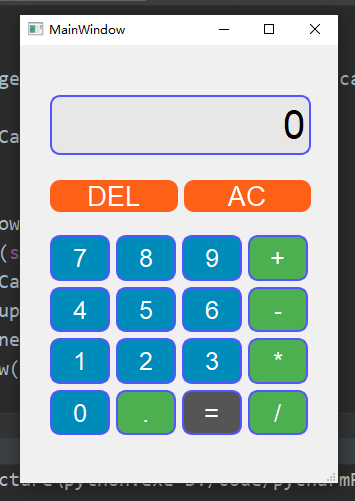
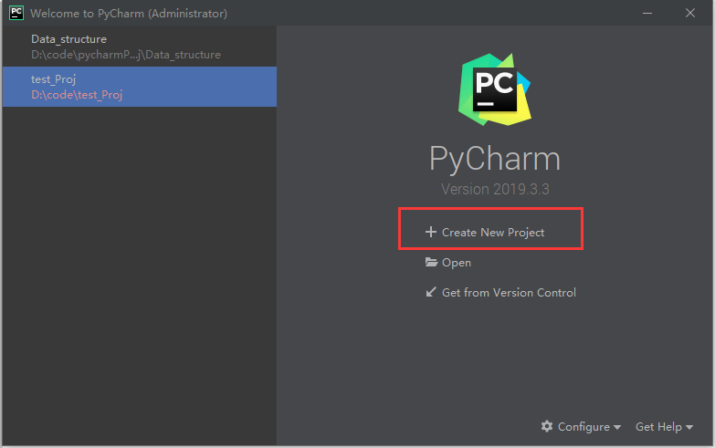
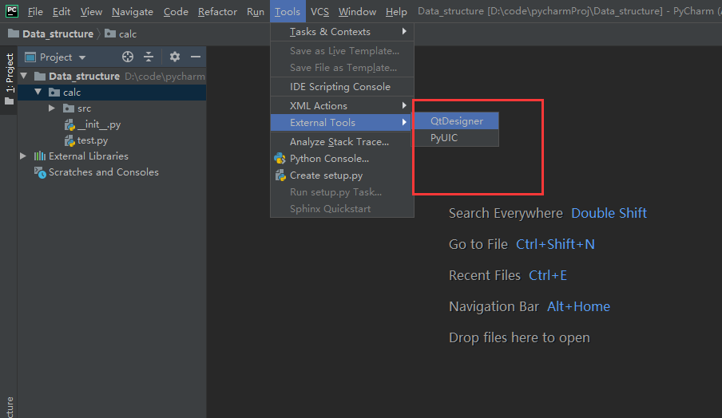
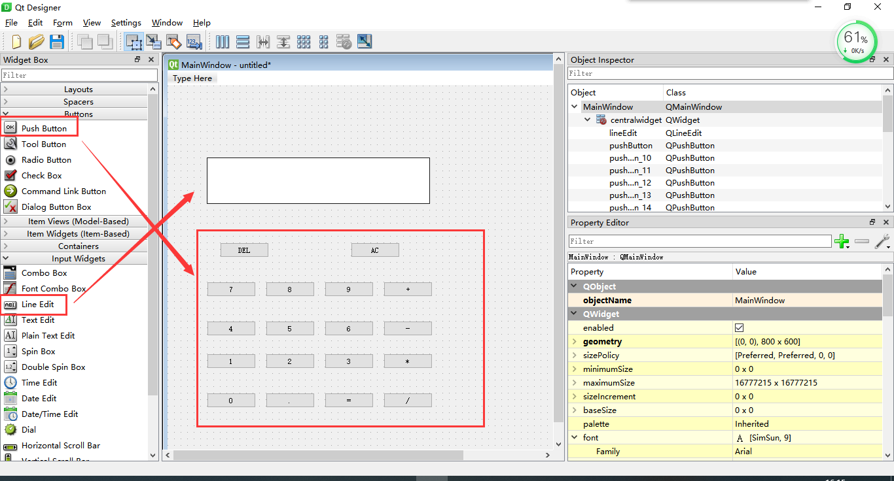
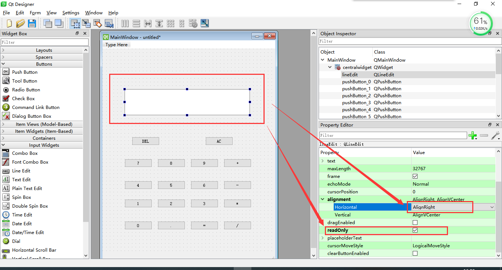
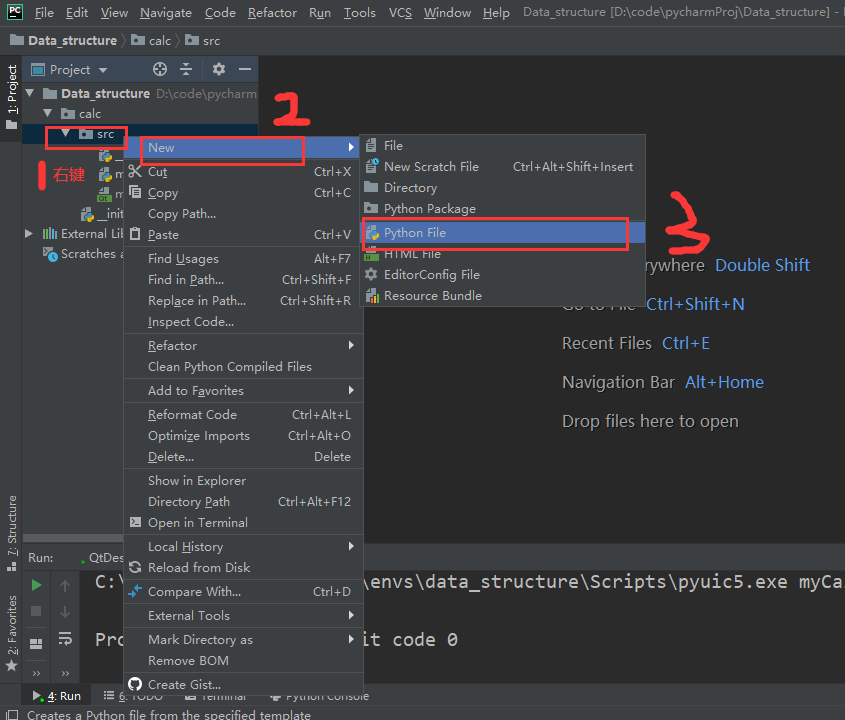
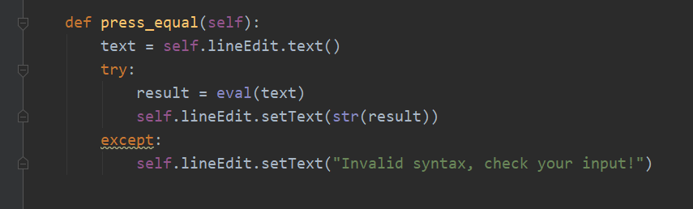
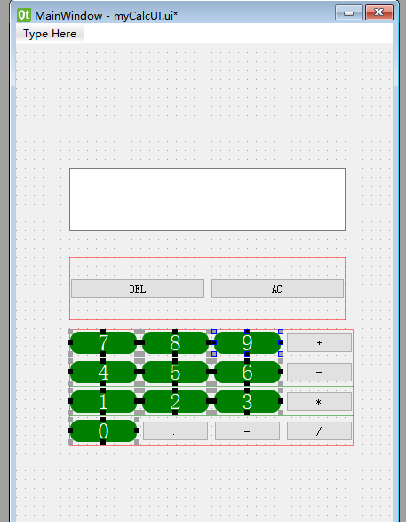

大家好，这周我们来做一个计算器。

这次作业目的是让大家熟悉下python的GUI编程，目标：

1.  熟悉 qt Designer 的使用

2.  熟悉pyqt5的使用

3.  熟练python 基本编程

    作业提交：

<!-- -->

1.  作业命名方式：

2.  [作业1-学号-姓名。
    作业提交邮箱：910660298\@qq.com](mailto:作业1-学号-姓名。提交到910660298@qq.com)

3.  截止日期：请于3月13日24：00前上交压缩包

4.  上交内容：一个word的实验报告【详细功能（思路+实例）+核心代码】以及可以运行的项目。

    先来看下我们要做的计算器的最终效果图：

    {width="3.6979166666666665in"
    height="5.21875in"}

实验准备
========

1.  打开pycharm，新建项目

    {width="5.766666666666667in"
    height="3.615972222222222in"}

2.  填好项目所存放的路径 和 上节课新建的anaconda环境，点"create"

    {width="5.766666666666667in"
    height="3.615972222222222in"}

实验步骤
========

UI设计
------

1.  上节课的公告里有两篇博客，配好这两个插件：其中QtDesigner是打开QtDesigner这个UI设计软件，PyUIC是将设计好的UI界面转化成python代码的工具。

    {width="5.763194444444444in"
    height="3.3402777777777777in"}

2.  点击QtDesigner，弹出如下界面：

    {width="5.7625in" height="3.05in"}

    选择"Main Window"， "create"

3.  介绍下这个Qtdesigner 的界面：

    {width="5.7625in" height="3.104861111111111in"}

    上学期学过java
    swing编程，大致知道每个控件都是干什么用的吧。如果不知道，把他们拖出来看看马上就能明白哒！

4.  按照计算器的样子，把控件拖出来

    {width="5.7625in" height="3.104861111111111in"}

5.  修改每个控件的上面的text。

    {width="5.7625in" height="3.104861111111111in"}

6.  修改每个控件上的对象名。这个对象名称是要在以后的逻辑代码中用的，起个容易的名字！{width="5.764583333333333in"
    height="2.96875in"}

    我起的名字分别是：

    pushButton\_0、pushButton\_1、pushButton\_2、pushButton\_3、pushButton\_4、pushButton\_5、pushButton\_6、pushButton\_7、pushButton\_8、pushButton\_9、

    pushButton\_point、pushButton\_equal、

    pushButton\_plus、pushButton\_sub、pushButton\_mul、pushButton\_div、

    pushButton\_DEL、pushButton\_AC、

    lineEdit

7.  计算器的显示框让他不能编辑，并且靠右显示：

    {width="5.3909722222222225in"
    height="2.904861111111111in"}

8.  按住Ctrl+R预览一下：

    {width="5.236805555555556in"
    height="2.7819444444444446in"}

9.  Ctrl+S保存到我们项目的路径里面，文件名字自己取，这时，我们项目中会多出一个".ui"文件

    {width="5.1506944444444445in"
    height="2.775in"}

10. 右键这个.ui文件，选择我们安装的第二个插件PyUIC，就能把.ui文件转换成.py文件啦！

    {width="4.020833333333333in"
    height="4.240972222222222in"}

    {width="4.114583333333333in"
    height="4.770833333333333in"}

11. 这就是简易计算器的UI界面啦！如果要做得和我一样好看点，那你就要学
    前端css，这部分教程我放在附录一里面，有兴趣的同学可以看一看。以后的作业，只要功能实现，好不好看无所谓。

逻辑代码部分：
--------------

12. 我们新建一个main.py文件，在这里写逻辑代码

    {width="6.6875in"
    height="5.698611111111111in"}

13. 写好主题框架代码：自己写一个类MyCalculator去继承我们前面通过UI创建出来的类。

    {width="6.4847222222222225in"
    height="4.465972222222222in"}

14. 往里面写一些基础代码，让你的窗体运行出来：

    {width="6.9319444444444445in"
    height="4.204166666666667in"}

15. Windows按ctrl+shift+F10 运行， mac按ctrl+shift+R运行，界面出现：

    {width="5.032638888888889in"
    height="5.305555555555555in"}

16. 接下来写事件监听和处理的代码，也就是你按下每个按键，都发生一件事。比如说，你按下"1"这个按钮，让显示框出现数字"1"

    {width="5.760416666666667in"
    height="2.817361111111111in"}

    除了"="按钮，其他按钮依样画葫芦。

17. 最后按下"="键的代码：

    {width="5.7625in"
    height="1.738888888888889in"}

18. 运行代码（同步骤15），大功告成！

    {width="5.761111111111111in"
    height="5.2347222222222225in"}

19. 作业做到这样就可以交了，明码标价，功能实现给90分，界面好看酌情加分。功能没实现59分。

附录一（使用css美化）
=====================

20. 有兴趣的同学看下怎么美化界面。界面美化又涉及到另外一个领域：前端设计。主要用到了css代码。

21. 首先使用布局，使界面看起来整齐。到qtdesigner，选中以下16个按钮，用网格布局排列。

    {width="6.668055555555555in"
    height="3.55625in"}

    同样，DEL 和 AC按钮也要，只不过是使用水平布局。

    {width="6.659027777777778in"
    height="3.9923611111111112in"}

22. 整理界面

    {width="5.7659722222222225in"
    height="4.081944444444445in"}

    {width="3.84375in"
    height="4.8180555555555555in"}

23. 设计样式

    {width="5.757638888888889in"
    height="3.201388888888889in"}

    {width="5.760416666666667in"
    height="3.6770833333333335in"}

    {width="4.760416666666667in"
    height="6.114583333333333in"}

    可以设计字体颜色、大小、背景颜色、边框颜色、边框粗细、色彩渐变......等着你去发掘！

附录二（参考文献）
==================

1.  【配置QtDesigner】[[https://www.jianshu.com/p/5b063c5745d0]{.underline}](https://www.jianshu.com/p/5b063c5745d0)

2.  【pyqt5教程】[[http://code.py40.com/pyqt5/16.html]{.underline}](http://code.py40.com/pyqt5/16.html)

3.  【css样式】[[https://www.w3school.com.cn/css/css\_background.asp]{.underline}](https://www.w3school.com.cn/css/css_background.asp)
