步骤1：对界面进行整体布局，画出整个界面，尽量的美观，输入模块肯定是要有的，不然怎么得到数据，然后就是一些链表所具有的功能，可以适当增减。功能：查找、删除、清空、显示表长等等等。

如下：图1

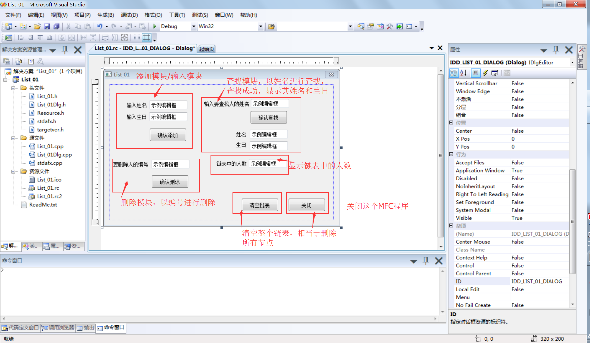{width="5.768055555555556in"
height="3.3640310586176727in"}

步骤2：修改一些控件的Caption属性，和ID属性。Caption已修改如图1中。需要修改的分别如下截屏。

{width="5.768055555555556in"
height="3.3640310586176727in"}

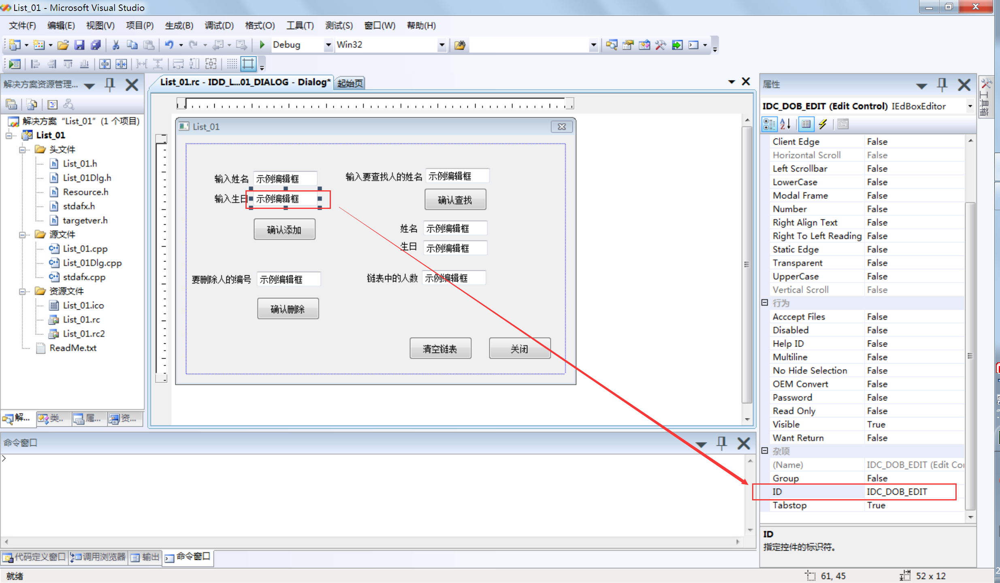{width="5.768055555555556in"
height="3.3640310586176727in"}

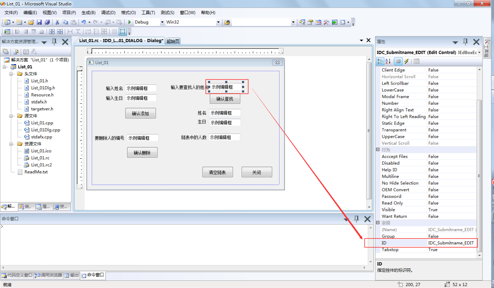{width="5.768055555555556in"
height="3.3640310586176727in"}

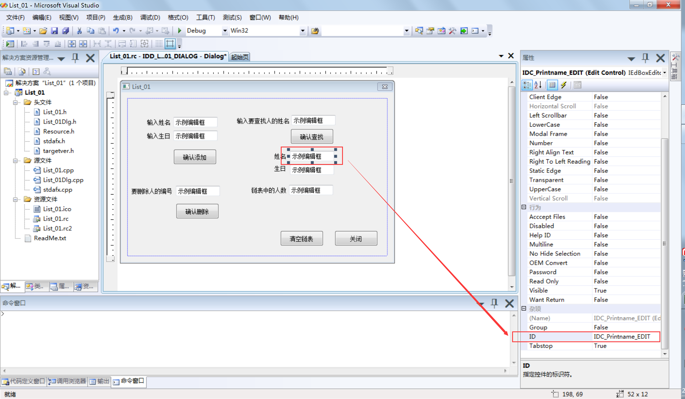{width="5.768055555555556in"
height="3.3640310586176727in"}

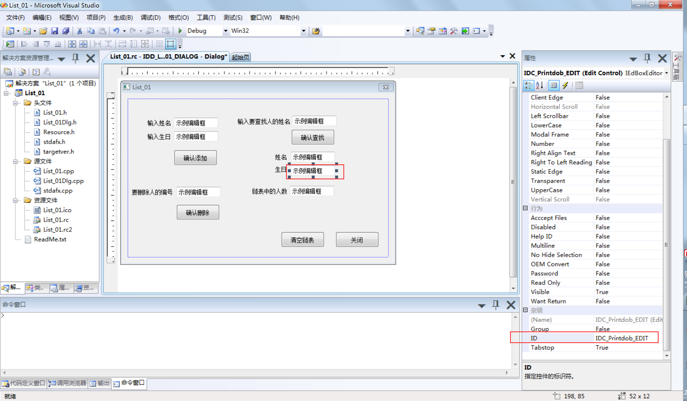{width="5.768055555555556in"
height="3.3640310586176727in"}

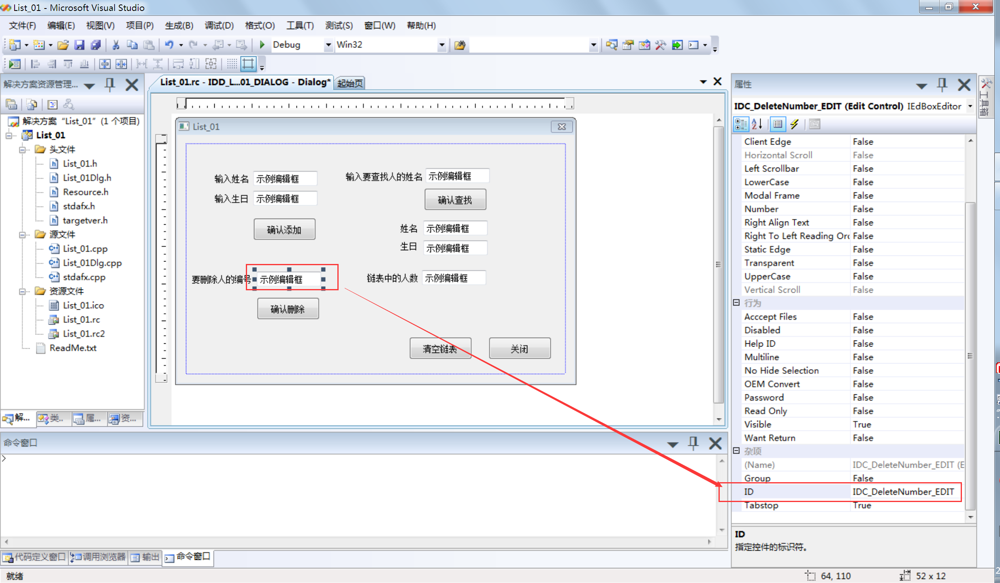{width="5.768055555555556in"
height="3.3640310586176727in"}

{width="5.768055555555556in"
height="3.3640310586176727in"}

修改所有Button控件的ID和Caption

{width="5.768055555555556in"
height="3.3640310586176727in"}

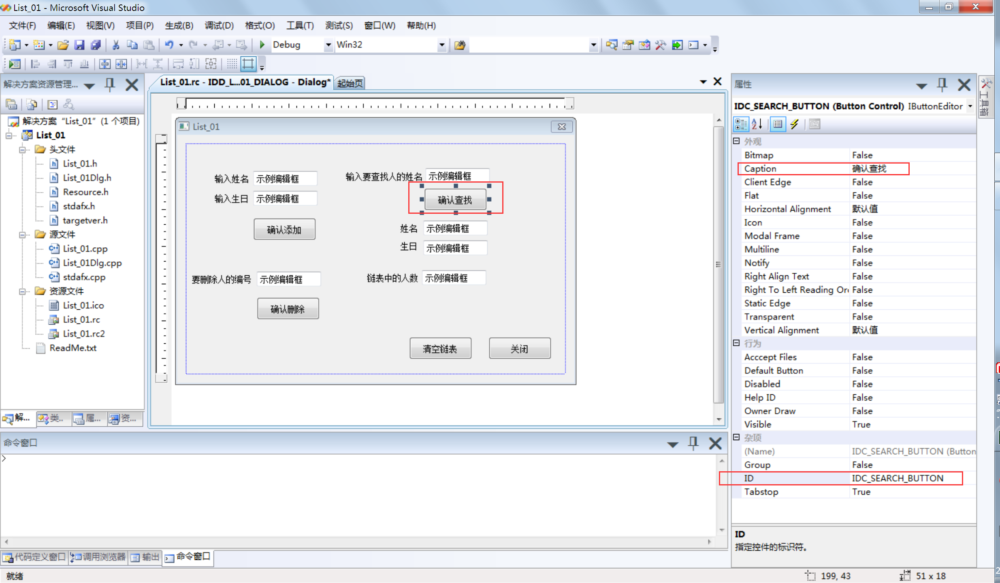{width="5.768055555555556in"
height="3.3640310586176727in"}

{width="5.768055555555556in"
height="3.3640310586176727in"}

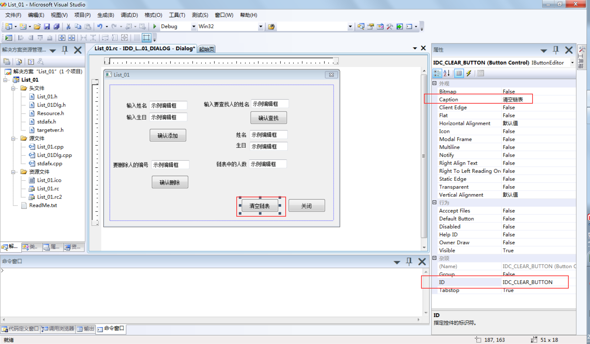{width="5.768055555555556in"
height="3.3640310586176727in"}

{width="5.768055555555556in"
height="3.3640310586176727in"}

步骤3：为每个Edit Control控件添加变量，用于保存输入的值。方法有两种：

1.  右击一个Edit
    Control控件，选中添加变量，出现如下截屏图，输入变量名，下图中，以输入姓名右边的Edit
    Control控件为例

{width="5.768055555555556in"
height="3.3640310586176727in"}

2.  在解决方案中，头文件目录下的List\_01Dlg.h
    中声明并定义需要添加的变量，如下截屏：

{width="5.768055555555556in"
height="3.3640310586176727in"}

其余的Edit
Control控件所需要的变量依次用第1种方法添加。如果法1不能成功添加，则通过法2;

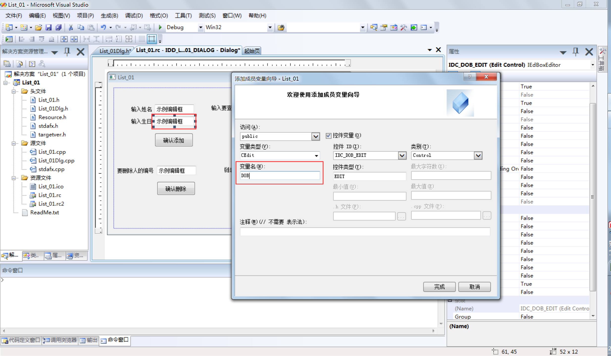{width="5.768055555555556in"
height="3.3640310586176727in"}

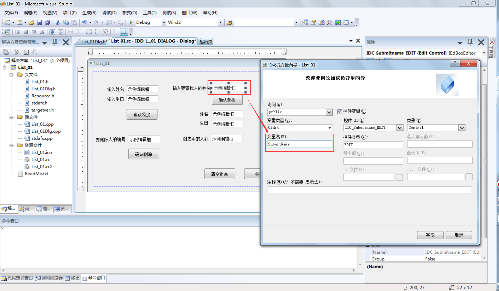{width="5.768055555555556in"
height="3.3640310586176727in"}

{width="5.768055555555556in"
height="3.3640310586176727in"}

{width="5.768055555555556in"
height="3.3640310586176727in"}

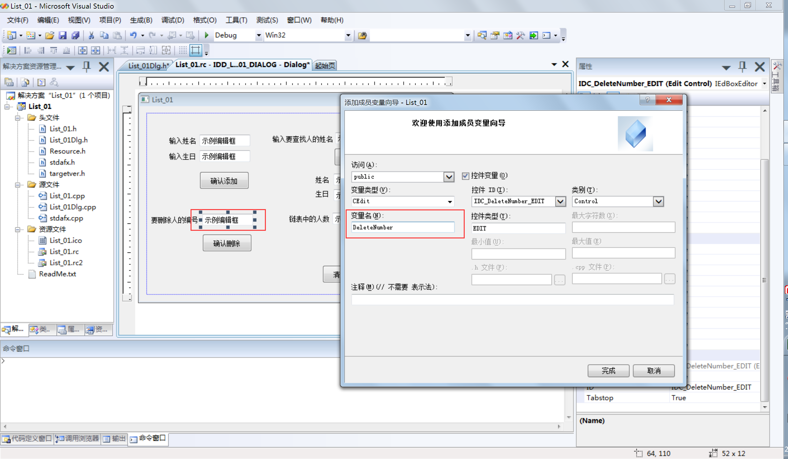{width="5.768055555555556in"
height="3.3640310586176727in"}

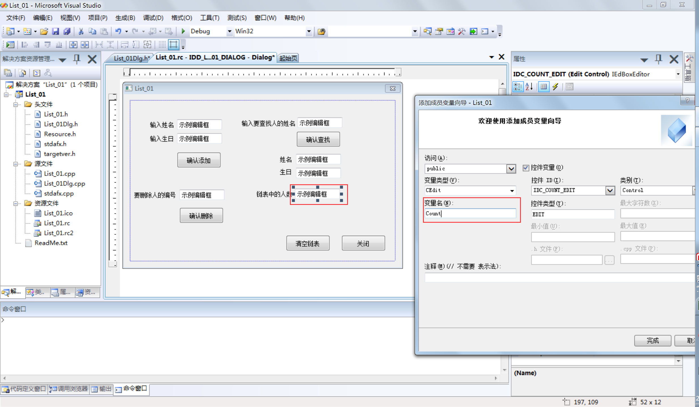{width="5.768055555555556in"
height="3.3640310586176727in"}

或者：在List\_01Dlg.h文件中添加截图中那一段。

{width="5.768055555555556in"
height="3.3640310586176727in"}

步骤三结束。

有个遗漏：：

插入位置这个忘记，不好意思。我们在后边补上，还是3个步骤。

{width="5.768055555555556in"
height="3.3640310586176727in"}

{width="5.768055555555556in"
height="3.3640310586176727in"}

步骤四：开始说节点怎么去定义和链表的插入，删除，查找等等。以及Button的响应函数据。

接着链表作业1：在作业1.doc中我们已经完成了界面布局，并对Button控件和Edit
Control控件的ID 以及 Caption进行命名。以及对每个Edit
Control控件添加一个变量用于保存每个输入的值。

步骤4：

我们在设计阶段，输入模块输入的有同学的姓名，生日，以及要插入到链表的位置。友情提示：我们可以在添加一些输入的信息，例如：性别，籍贯，个性签名等等等。这个请自行设计。最后在提交的时候，最好不要与讲的一模一样，一定要动手去做。

4.1 节点的设计。

如何去声明定义一个链表节点类型。我们右击头文件，选中添加，再选中新建，添加一个Node.h。在这个.h文件中，我们去声明和定义链表节点类型。

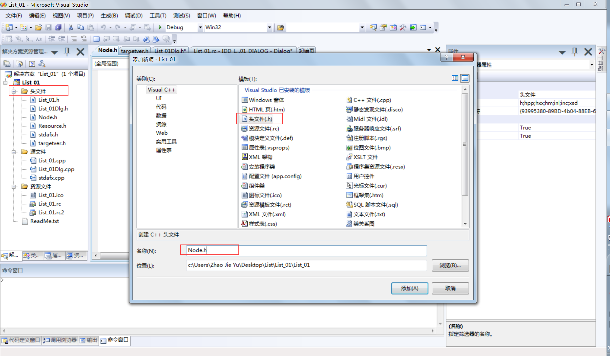{width="5.768055555555556in"
height="3.3640310586176727in"}

{width="5.768055555555556in"
height="3.3640310586176727in"}

对于C++类的知识大家如果还不熟悉的话，请自行复习。

我们在写一个Node.cpp 对Node.h中Node类中的构造函数，和析构函数进行实现。

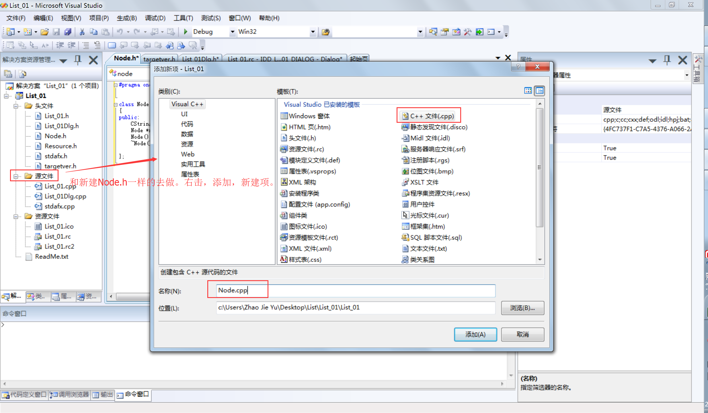{width="5.768055555555556in"
height="3.3640310586176727in"}

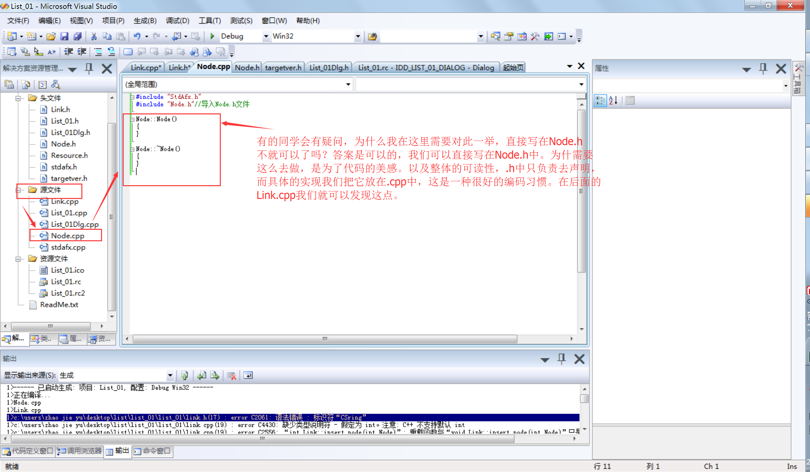{width="5.768055555555556in"
height="3.3640310586176727in"}

节点类型Node类就这么定义完了，那么接下来需要做的就是完成链表的功能函数。增加，删除，查询，等等等。
还是与Node类定义一样，先在Link.h中声明链表，在Link.cpp中进行实现。

{width="5.768055555555556in"
height="3.3640310586176727in"}

这样，我们是不是，很明显看出来链表中有哪些功能，能做哪些事情，这样去写代码，代码显示上不是太冗余。接下来我们再在Link.cpp去实现这些在Link.h中定义的成员函数。

{width="5.768055555555556in"
height="3.3640310586176727in"}

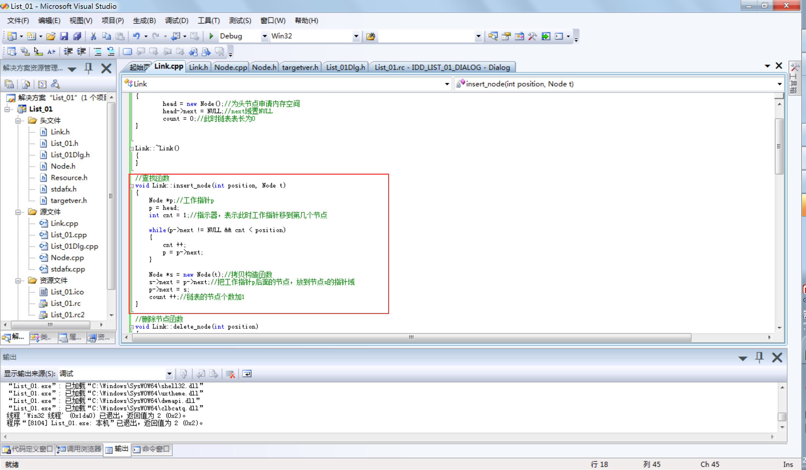{width="5.768055555555556in"
height="3.3640310586176727in"}

{width="5.768055555555556in"
height="3.3640310586176727in"}

{width="5.768055555555556in"
height="3.3640310586176727in"}

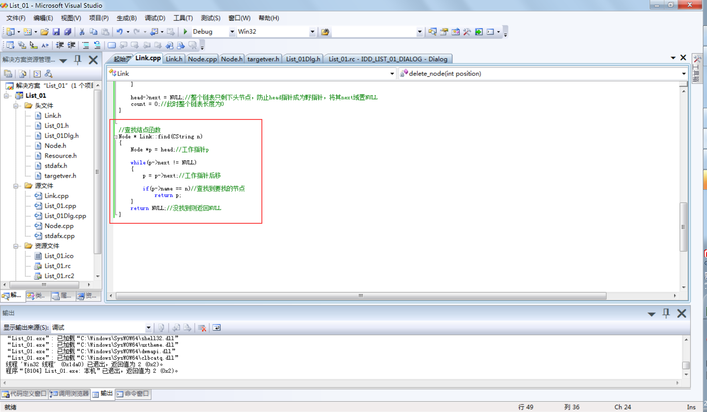{width="5.768055555555556in"
height="3.3640310586176727in"}

步骤4：结束，到此我们已经完全定义并实现了链表的添加，删除，查询，显示表长，以及清空链表。

友情提示：我们还可以添加一些链表的功能函数，例如:倒数第10个同学是谁，或者说有没有同姓名的同学，或者同学的信息由籍贯的，可以查找如：浙江杭州，看看有哪些同学，（这个功能要注意显示的控件的设计上，大小设计，或者选择其他的控件，大家可以做的更加完美一些）

友情提示：之前每一步做完，我忘记去运行调试，不知道我写的有没有问题，你们之前的每一步记得加上，我们现在运行。（主要还是这步，因为写代码，可能错在语法等等的错误。）

{width="5.768055555555556in"
height="3.3640310586176727in"}

步骤5：这个步骤我们写Button控件的响应函数。通俗的话，点击按钮会得到响应，就像我们登录QQ一样，输入完帐号和密码，然后点击登录，登陆到QQ界面。五个Button控件我们一个个的来写。关闭那个，大家回忆一下，这个是不是最简单的，只需要一句话就可以了，我们在第三周的实验课，就已经说过，只需要一句OnOK()，还有没有印象。

我们需要写5个Button的响应函数。如下截屏：

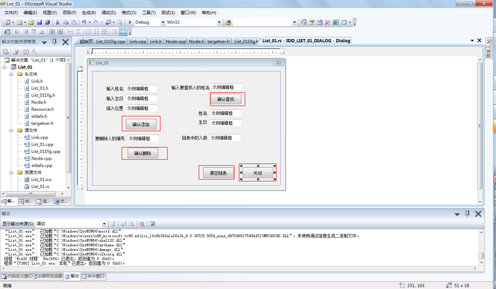{width="5.768055555555556in"
height="3.3640310586176727in"}

还知道不知道怎么去写Button的响应函数，就是双击Button。然后进入List\_01Dlg.cpp中。我们先写关闭这个按钮的响应函数。

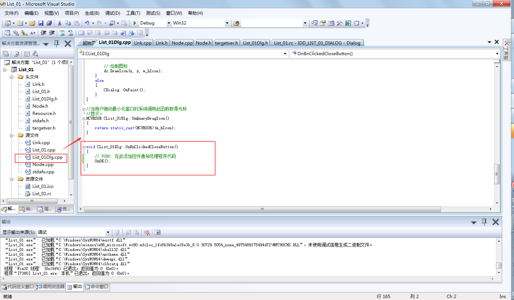{width="5.768055555555556in"
height="3.3640310586176727in"}

然后我们来写"确认添加"这个按钮的响应函数,双击进去。再这一步之前我们还需要添加一个变量，还需要添加什么变量呢？大家想一想。

添加一个Link
list；就是添加一个Link类对象list。这个我们就在List\_01Dlg.h中添加。

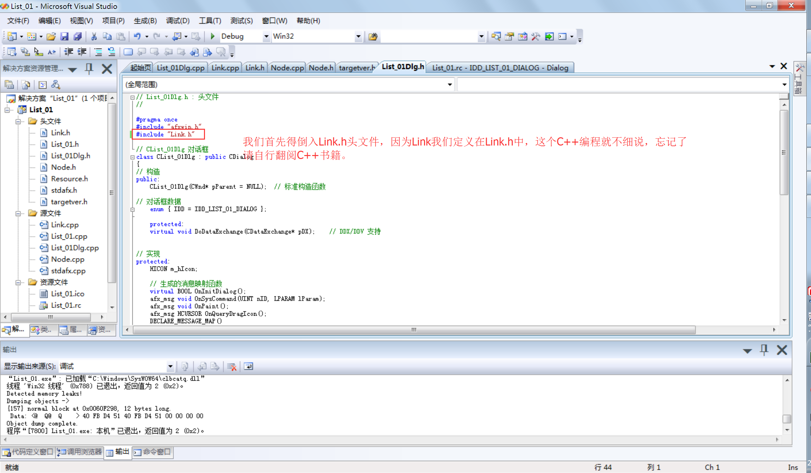{width="5.768055555555556in"
height="3.3640310586176727in"}

{width="5.768055555555556in"
height="3.3640310586176727in"}

再来写"确认添加"的响应函数。

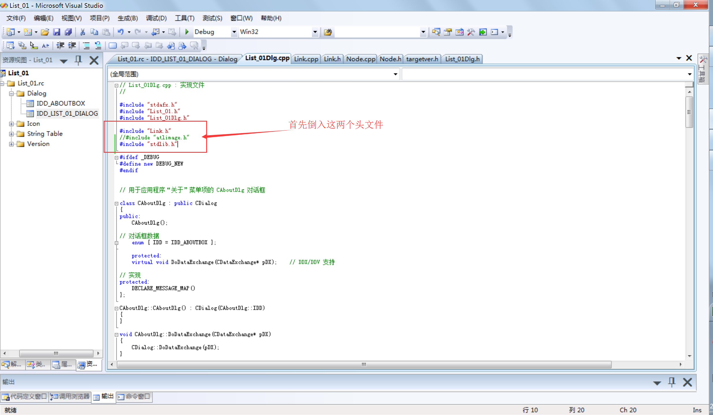{width="5.768055555555556in"
height="3.3640310586176727in"}

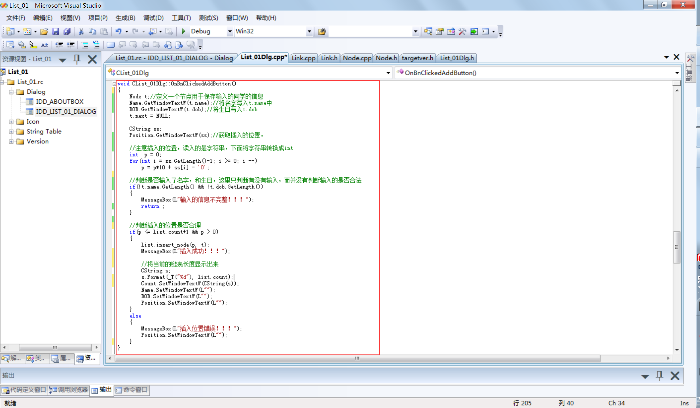{width="5.768055555555556in"
height="3.3640310586176727in"}

再来写确认删除 Button的删除函数 ，具体注释就不详细解释了。

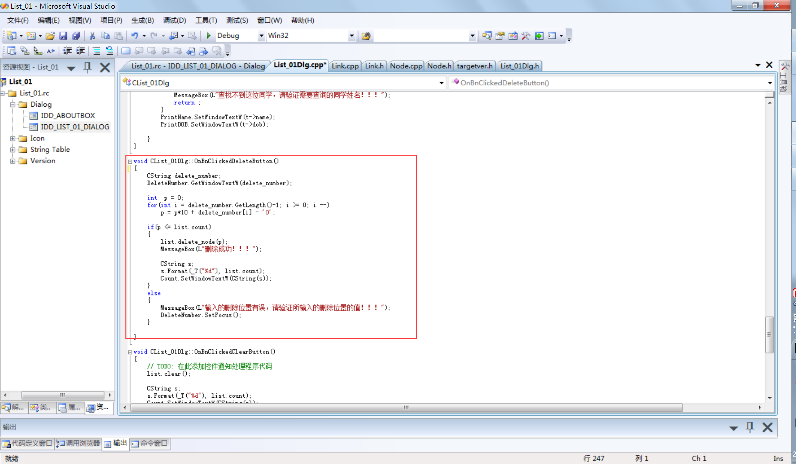{width="5.768055555555556in"
height="3.3640310586176727in"}

再来写 确认查找 Button的响应函数

{width="5.768055555555556in"
height="3.3640310586176727in"}

再来写 清空链表 Button的响应函数

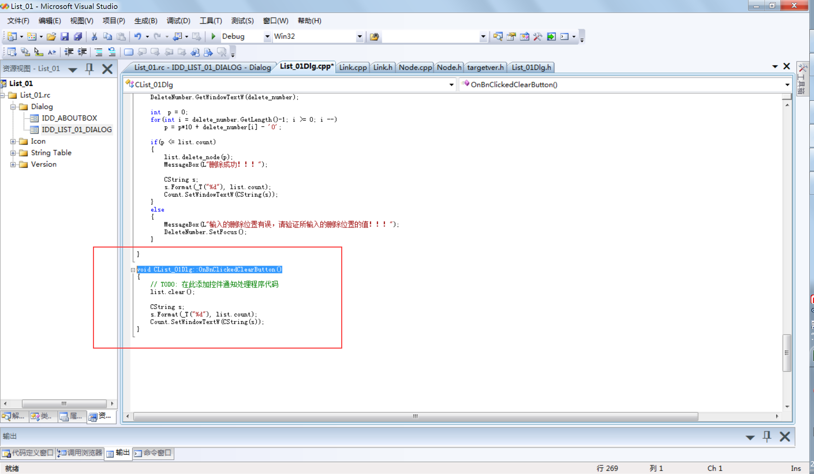{width="5.768055555555556in"
height="3.3640310586176727in"}

到此，以完全介绍完毕，下面进行测试

同学1 姓名：Ningbo 出生年月： 20160322

同学2 姓名：NingBO 出生年月： 20160323

然后进行添加：

测试添加：

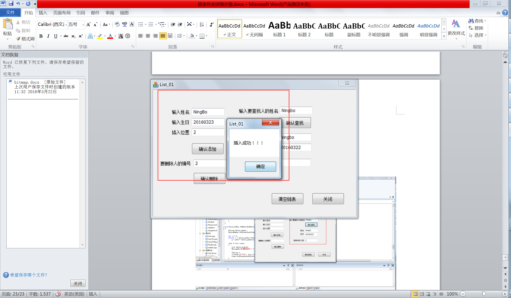{width="5.768055555555556in"
height="3.3667016622922135in"}

测试查找：

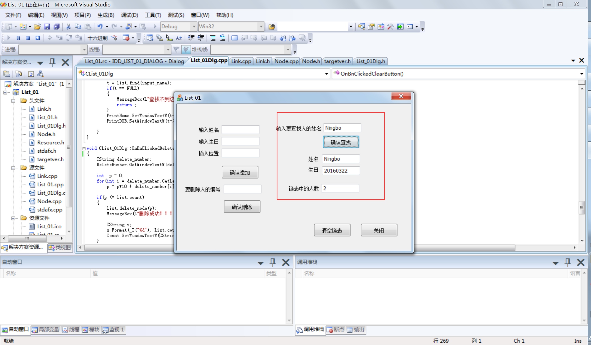{width="5.768055555555556in"
height="3.3640310586176727in"}

测试删除：

{width="5.768055555555556in"
height="3.3667016622922135in"}

测试清空：

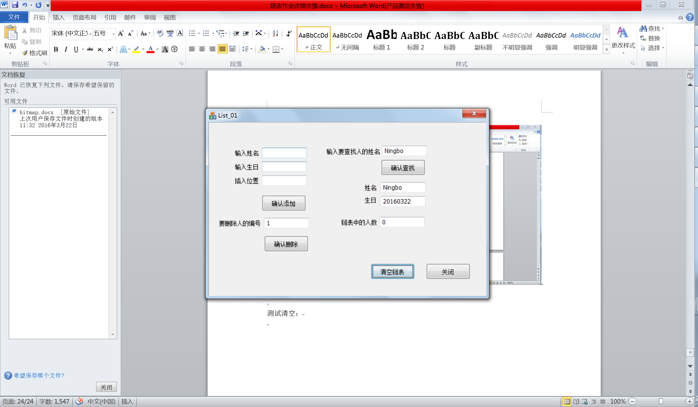{width="5.768055555555556in"
height="3.3667016622922135in"}

OK。
到此你是不是List\_01这个版本还有许多bug，许多漏洞呢。比如我我在测试情况之后。我的要删除编号里面的1还在显示，以及右边的查找数据还在，这是不是2个bug。此外，你在出生年月，可以随便输入一段字符串，这也是一个bug。都是需要大家去修改和完善了。还有就是照片的显示我并没有加进来，可以想想怎么去加。在完成这个版本的基础之上，再进行修改和完善。

OK 结束。
