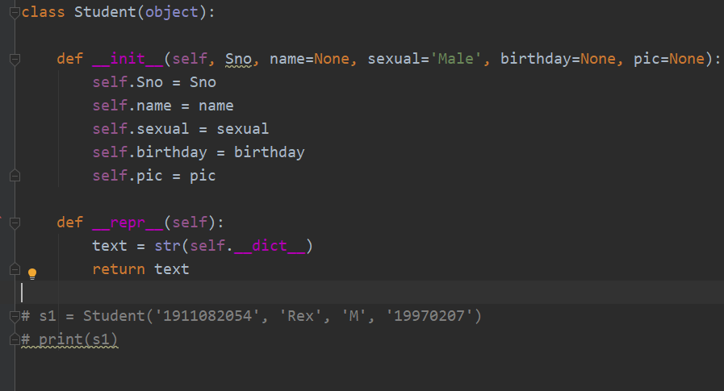
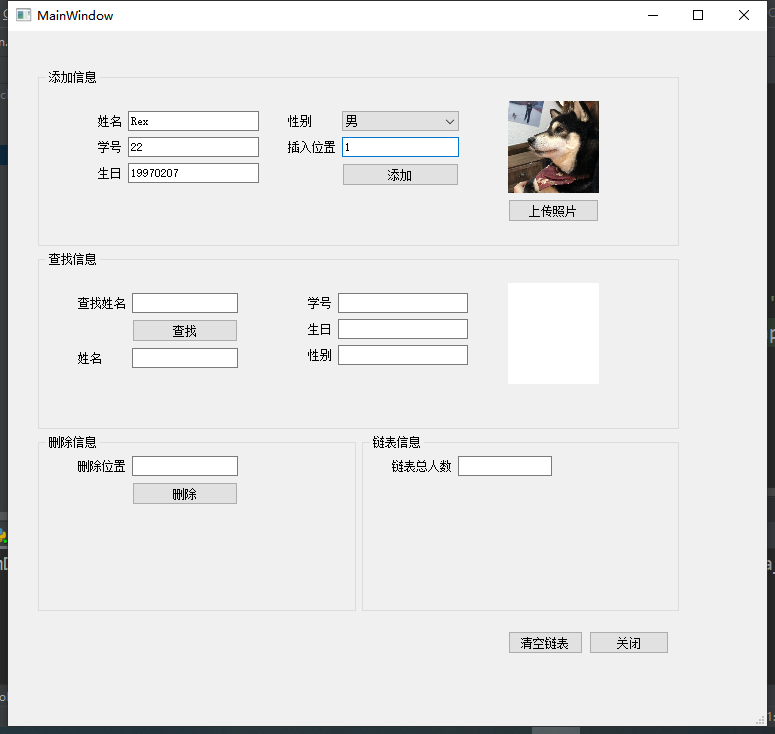

### 步骤1：整体布局搭建

对整体页面进行布局，合理搭建U/I部分，首先实现链表内容的输入窗口，根据自己设计的链表属性适当新增输入控件。


### 步骤2：调整输入接口属性

对输入控件的属性进行调整，使整体页面更具有交互性。


### 步骤3：将.ui文件转为python文件

```python
pyuic5 -o demo.py demo.ui
```

其中：

- -o是操作参数，表示要生成一个文件
- demo.py是要生成的.py文件
- demo.ui是在此之前用QTDesigner生成的包含UI设计的.ui文件

### 步骤4：创建链表主类

设计自己要实现的链表类，并定义该类属性



### 步骤5：实现控件功能

对每一个控件编写函数，实现对链表类的交互。


### 步骤6：测试project

检验实现情况，建议分部检验，确认无误后提交上传。


