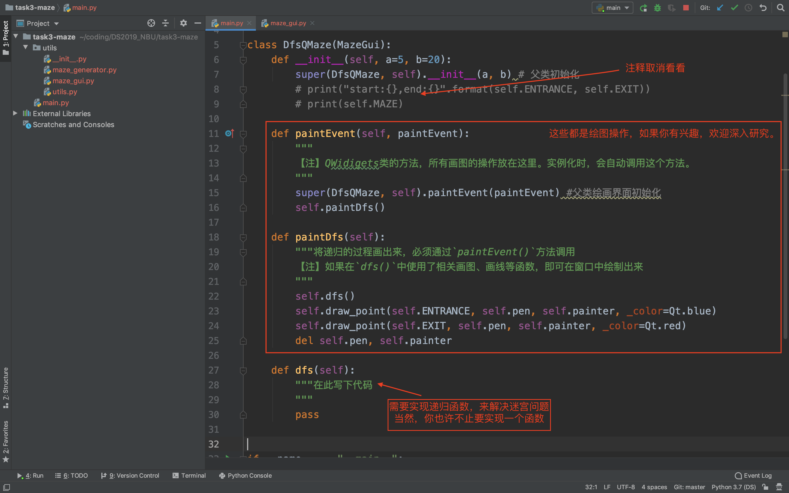
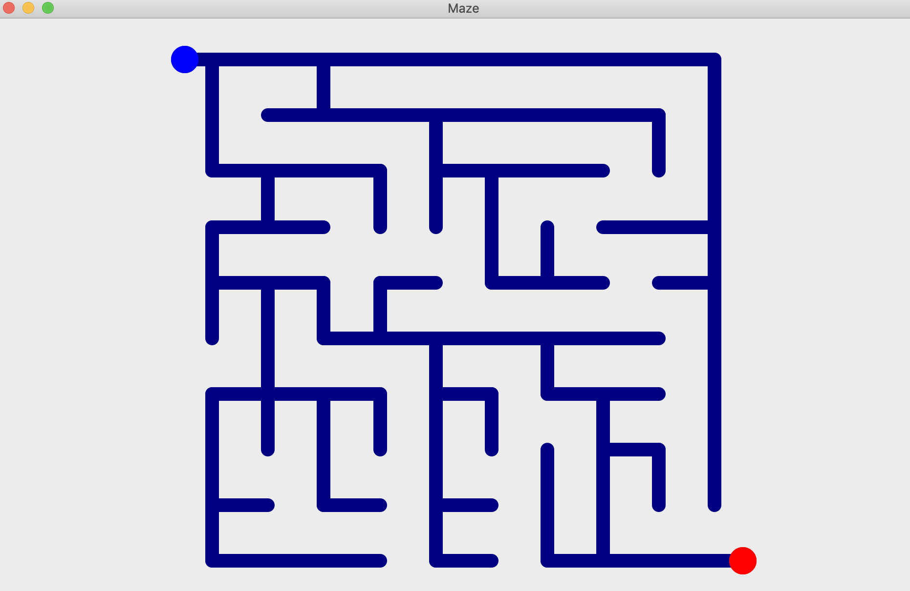

# 使用递归解决迷宫问题

## 1 前言

​		欢迎来到本节实验，本节我们将了解如何使用深度优先来解决迷宫问题。我们学习了递归函数，也了解了深度优先搜索的知识，我们可以用这种搜索技术来解决迷宫问题。让我们先看一看最终的结果：


​		其中暗蓝色表示迷宫可以走的路线，绿色表示求解的通路，黄色表示走到死胡同后返回，蓝点表示起点，红点表示终点。

​		要实现这样一个界面效果不是很难，但是没有PyQt的相关基础，需要花较长时间去了解。但不要担心，我们实现了界面代码，你只需要专注算法本身即可。本项目由三个部分组成：

- 迷宫生成模块

- 迷宫绘图模块

- 递归解决迷宫问题模块

  我们只需要实现第三个功能即可。本实验的代码见: https://github.com/QiangZiBro/DS2019_NBU/task3-maze 。

## 2 做作业流程

​		我们使用github存放课程相关教学代码，如果还有不会使用github的同学请自学如何使用这个网站和git相关知识，本教程不再赘述。

- 第一次使用，克隆我们课程仓库

```
git clone https://github.com/QiangZiBro/DS2019_NBU
```

- 将项目文件夹(比如`task3-maze`)复制到您的电脑一个位置 
- 用您的编辑器（如pycharm)打开这个项目(比如`task3-maze`)进行自己的学习和开发 
- 发送作业代码到助教邮箱：1911082231@nbu.edu.cn
- 上交实验报告到课程网站

## 3 相关讲解

### 代码框架

​		我们实现了**迷宫生成模块**和**迷宫绘图模块**相关代码，放在`util`目录下。其中原理不要求了解，但您可以大致浏览一遍，了解源代码如何使用，以及pyqt是如何画图的。我们用pycharm打开工程，编辑其中的`main.py`文件，如下：




​		直接运行，便可以得到初始迷宫界面：




### 基本原理讲解

​		【注】相信大家了解过编程语言面向对象的相关知识了，如果对python面向对象不了解，可以参考：https://www.liaoxuefeng.com/wiki/1016959663602400/1017495723838528。当您把这一章跟着代码敲完，相信对面向对象有一定了解。

​		**界面**

​		我们实现了一个`MazeGUI`对象，完成**迷宫生成模块**和**迷宫绘图模块**功能。在main程序中直接继承这个对象，并进行初始化，即得初始界面。这个对象的使用方法:

```python
class DfsQMaze(MazeGui):
    def __init__(self, a=5, b=20):
        super(DfsQMaze, self).__init__(a, b) # 父类初始化
        # print("start:{},end:{}".format(self.ENTRANCE, self.EXIT))
        # print(self.MAZE)
```

​		

​		**迷宫表示**		

​		可以看到，父类方法初始化后，我们得到了3个变量。而我们编程时需要用到这三个变量，请大家仔细理解：

- `self.MAZE` 一个二维数组，数组的每个位置有两种数值：1表示墙，0表示路。初始迷宫只画出了路。比如，一个边长为5的迷宫表示为

```
[[1, 1, 1, 1, 1],
 [0, 0, 1, 0, 1], 
 [1, 0, 1, 0, 1],
 [1, 0, 0, 0, 0], 
 [1, 1, 1, 1, 1]]
```


- `self.ENTRANCE`     入口，[x,y]，其中x是行，y是列。比如上面例子中[1,0]位置是0

- `self.EXIT`             出口，也是位置的表示

     **画图**

​        根据迷宫的特点，我们实现了一个画线的函数，能够汇出从迷宫一个点到另外一个点的过程。只需要在你要编码的方法`dfs()`内调用即可：

- `self.drawLine(coor1, coor2, color=Qt.yellow, width_scale=0.5)`
  - coor1,coor2表示迷宫坐标点
  - color表示颜色
  - width_scale表示线粗细程度

接下来可以开始编码，完成递归程序编写，祝好运！

