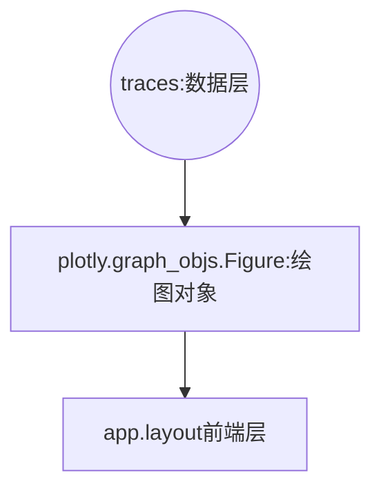
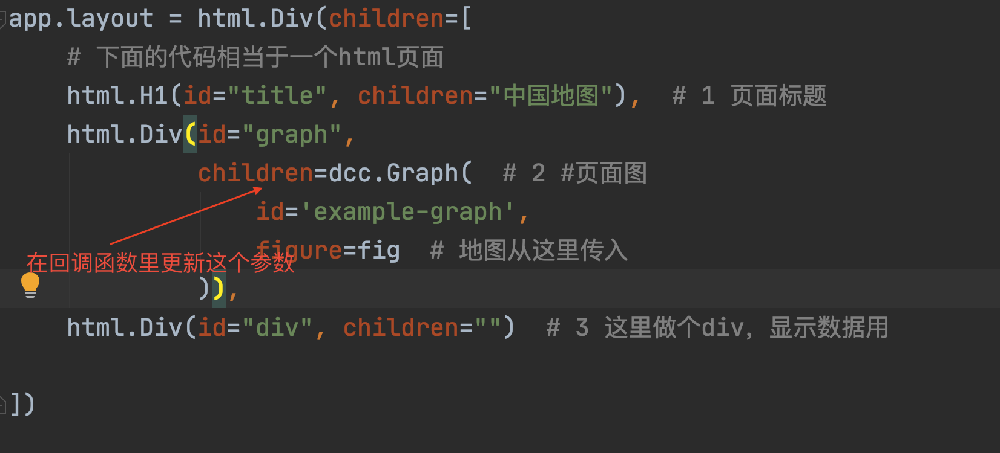

# Plotly dash画图的几个问题

学习完上一个dash教程，大家会将经纬度点画在地图上，但也遇到一些问题，整理的问题有以下几个方面

## 1 只有点，怎么设置哪些点相连？

这个可以自己规定，有理即可。

## 2 怎么画点或线？

首先解释下，dash app直接帮助我们搭建了一个**web服务器**，也就是说，以一个网页的形式展现。我们与网页交互时，后台会按照我们编写的逻辑代码运行

我们调用一些dash api就可以进行简单的前端的编写，这些都是python程序，不用关心前端（html，js，css等）代码

### 2.1 程序初始，图是怎么画的

**原理解释**

运行程序，初始化时，dash画图的基本流程如下：



**步骤详解**

第一步构建一个图层列表traces`，列表每个元素都是一个`go.Scattermapbox`对象，初始化对象时给定初始参数，就可以完成<u>**画点**</u>或者<u>**画线**</u>操作

```python
traces = list()
traces.append(
    go.Scattermapbox(
        # 1.画点
        mode="markers",
        # 2.画线
        # line=go.scattermapbox.Line(color="blue"), #2.1
        # mode="markers+lines", #2.2

        text=names,
        lon=logs,
        lat=lats,
        marker={'size': 10},
        marker_color='red'
    )
)
```

第二步，将traces传入plotly的绘图对象，然后对绘图对象做一些配置

```python
fig = go.Figure(data=traces)
fig.update_layout(
    margin={'l': 3, 't': 3, 'b': 3, 'r': 3},
    mapbox={
        'center': {'lon': places['河南'][0], 'lat': places['河南'][1]},# 地图的中心在河南
        'style': "stamen-terrain",
        'zoom': 3,
    },
    autosize=True
)
```

第三步，将上一步的绘图对象传入网页

```python
app = dash.Dash(external_stylesheets=external_stylesheets) # app初始一次就ok
app.layout = html.Div(children=[
    # 下面的代码相当于一个html页面，使用python代码编写
    html.H1(id="title", children="中国地图"),  # 1 页面标题
    html.Div(id="graph",
             children=dcc.Graph(  # 2 地图
                 id='example-graph',
                 figure=fig  # 地图从这里传入
             )),
    html.Div(id="div", children="")  # 3 这里做个div，显示数据用

])
```

ok，完成这三步，图就画好了。注意前后还有一些配置代码，不要直接复制这三步的代码去运行。

网页结构如下：

首先显示一个标题，使用`html.H1`

下面显示一个地图，使用前面得到`fig`，构建一个` dcc.Graph`对象，传进一个`html.Div`标签。

地图下面我们希望展示一些文本信息


注意，前端每个标签`id`属性都是标记网页模块内容的。因此：**指定回调函数的输出到这一id的某一个属性，就可以更改网页内容。**

### 2.2 求出最短路径，怎么画线？

方法是更新前端页面中，地图这一部分，即更新id为graph的标签，其中的children属性，如下图。



怎么更新？可以在回调函数中多设一个返回值，这个返回值表示的是前端的地图部分：

```python
@app.callback(
    [Output('div', 'children'), Output('graph', 'children')], #回调输出
    [Input('example-graph', 'clickData')]) #输入
def display_click_data(clickData):
        """
        每次点击地图点，都调用这个函数
        """
   			# 略，同之前一样
        if len(two_points) == 2: #当选了两个点
            solve_shortest_path() #求最短路径
            
            ##############新增#####################
            trace 								# 第一步，构建trace，同前面方法
            fig 									# 第二步，构建fig， 同前面方法
            graph =  dcc.Graph(  	# 第三步，构建前端上的地图模块
                 id='example-graph',
                 figure=fig  # 新地图从这里传入
            ))
            #######################################
        		return MSG, graph
				# 后略
```


注意

- 一个回调函数所有的返回值都一致，也就是说，这里返回了两个参数，不要其他情况只返回一个参数

```mermaid
graph TD;
选择两个点 --> 求最短路径 --> 
```

