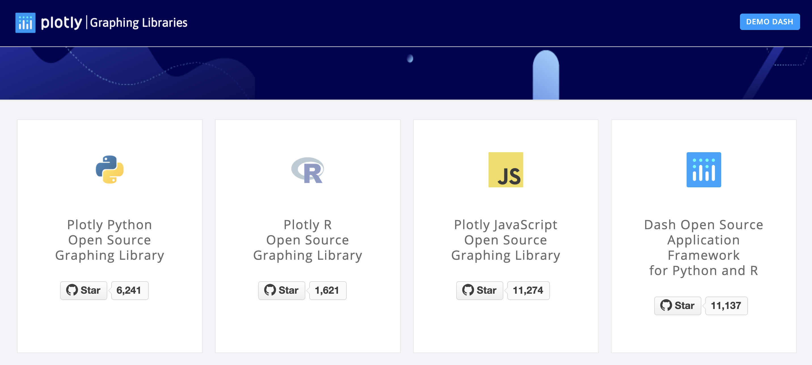
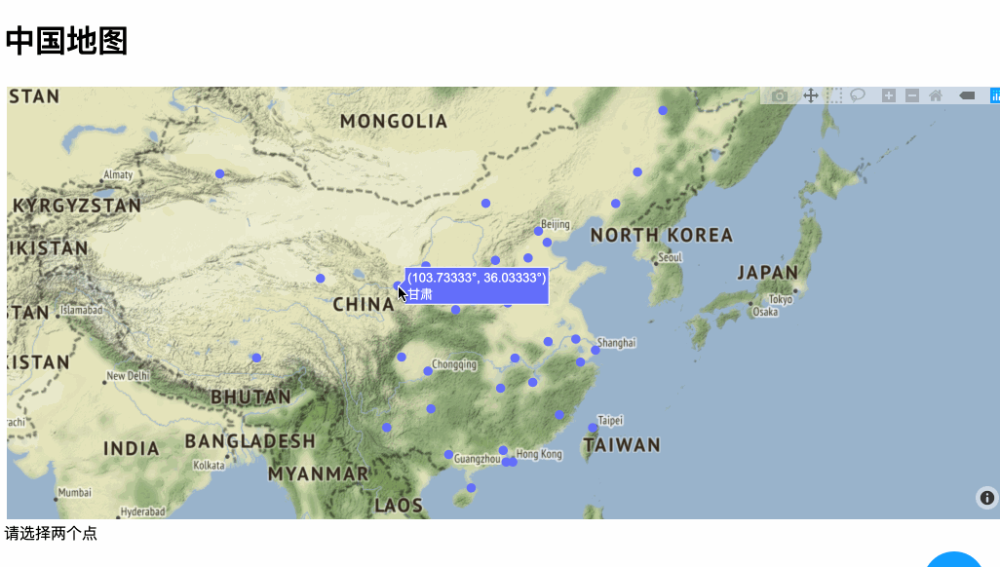

# 使用plotly绘制中国地图，并实现出行路线规划	

[TOC]


## 前言

​		python画地图有许多库可选择，我们使用plotly这个库进行地图绘制。plotly不仅是一款开源框架，更是一个商业公司。所以其文档丰富，案例齐全，当然我们可以免费学习和使用它。如下图，plotly开源绘图库有四大板斧，我们本次使用第四板斧——dash。本文讲解了构建一个dash应用的必须操作。网上有一些介绍的[帖子](https://zhuanlan.zhihu.com/p/83140406)可以作为参考，但具体细节还是建议参考官方文档。



## 步骤

​		图的这一个章节作业要求是实现最短路径算法，并能用鼠标在中国地图上进行交互式选点，接着求最短路径。对任务目标进行细分：

- 实现图的数据结构和最短路径算法
- 加载全国各省市坐标点
- 设计地图界面编程，使得地图能够处理鼠标点击，并在点击时获得其地理位置信息
- 设计好相关算法接口，能够处理经纬度，并使用最短路径算法求解
- 在地图上画出结果，点和点之间用直线相连

### 可视化界面

​		首先需要建立一个可视化界面，可供数据输入、展示。笔者使用plotly的dash产品，当然，不使用dash可以吗？当然可以。但相信看完dash [gallery](https://dash-gallery.plotly.host/Portal/)后，你会喜欢上这个框架。官网对dash的介绍是

> Build beautiful, web-based analytic apps. No JavaScript required.

​		构建一个dash app需要以下几个流程：

#### **准备工作之一：导入相关的库**

```python
import dash
import dash_core_components as dcc
import dash_html_components as html
import plotly.graph_objs as go
from dash.dependencies import Input, Output
```

#### **准备工作之二：准备相关数据**

​		地点用经纬度表示，将经度和纬度各放到一个list里，注意每个位置上要对应起来。从网上搜到了一些地名——经纬度的对应，然后给对应经、纬度、地名提取出来。

```python
places = {
    '山东': [117.000923, 36.675807],
		...
}
logs = []
lats = []
names = []
for k, v in places.items():
    names.append(k)
    logs.append(v[0])
    lats.append(v[1])

external_stylesheets = ['https://codepen.io/chriddyp/pen/bWLwgP.css'] #app样式
```

#### **画图三部曲之一：构建若干个trace**

​		dash每个图层用一个函数或类表示，比如下面用到的类是`plotly.graph_objs.Scattermapbox`，其功能是画点。我们把这样的一个图层叫做trace，每个trace有自己独特的特征。比如我们把下面代码中`mode="markers"`换成`mode="markers+lines"` ，就可以把这一个trace里所有的点连接起来。不同trace如果不规定颜色，显示时会以不同颜色显示出来，你还可以在浏览器里点击这些trace进行交互。把所有图层都放到一个list里面，进行下一步步骤。这和matplotlib画图有些许差别，后者是直接把数据放进一个大函数里面。参考官方[api](https://plot.ly/python-api-reference/generated/plotly.graph_objects.Scattermapbox.html)后，使用了下面几个参数：

```python
traces = list()
traces.append(
    go.Scattermapbox(
        mode="markers", # mode="markers+lines" 画点和画线
        text=names,
        lon=logs,
        lat=lats,
        marker={'size': 10}, 
        marker_color='red' 
    )
)
```


#### **画图三部曲之二：使用Figure**

​		将上面构建的数据列表传到`plotly.graph_objs.Figure`类里面，并规定其展示时相关样式。

```python
fig = go.Figure(data=traces)
fig.update_layout(
    margin={'l': 3, 't': 3 'b': 3, 'r': 3}, # 边缘距离
    mapbox={
        'center': {'lon': places['河南'][0], 'lat': places['河南'][1]}, #图的中心在河南这里
        'style': "stamen-terrain",
        'zoom': 3 # 放大倍数
    },
)
```


**画图三部曲之三：使用dash.Dash构建app**

​		dash app相当于有若干html组件构成，下面传入三个组件，即可构成html界面。我们不需要去写复杂的html界面，dash框架会帮我们完成这些事情。将上面得到的`fig`传入`dcc.Graph`类:

```python
app = dash.Dash(__name__, external_stylesheets=external_stylesheets)
#一个完整的界面
app.layout = html.Div(children=[
        html.H1(id="title",children="中国地图"), #1
        dcc.Graph( #2
            id='example-graph',
            figure=fig  # 地图从这里传入
        ),
        html.Div(id="div", children="") #3
    
])
```

#### **点击响应**		

​		地图画好了之后，我们希望能够有点击响应，鼠标点击一个点，得到其经纬度。注意到，我们点击的其实上面`app.layout`层中id为`example-graph`的标签。实现响应函数，只需用`app.callback()`进行装饰。来看看这个装饰函数如何写：

```python
@app.callback(.
    Output('div', 'children'),
    [Input('example-graph', 'clickData')]) #输入第一个参数是id名称，第二个是函数参数
def display_click_data(clickData):
    global two_points
    if clickData:
        point_dict = clickData['points'][0]
        lon = point_dict['lon']
        lat = point_dict['lat']
        text = point_dict['text']
        return "您选择了 {}:({},{})".format(text, lon, lat)
    else:
        return ""
```

**输入** `Input('example-graph', 'clickData')` 要用一个`Input`类来包装，第一个参数是html对应id为`example-graph`，第二个参数是该组件的点击响应参数`clickData`。可以看`example-graph` 的参数有

> ['id', 'responsive', 'clickData', 'clickAnnotationData', 'hoverData', 'clear_on_unhover', 'selectedData', 'relayoutData', 'extendData', 'restyleData', 'figure', 'style', 'className', 'animate', 'animation_options', 'config', 'loading_state']

点击响应是其中一个属性。

**输出**  `Output('div', 'children')`  要用一个`Output`类来包装，分别对应id和标签属性

**最后**

```python
if __name__ == '__main__':
    app.run_server(debug=True, port=8052)
```

​		到此，画图、显示、点击响应，就做完了。我们希望点击两个点后就去计算最短路径，因此需要处理点击的点。

---


### 设计鼠标点击处理

假设我们实现了最短路径算法：

```python
def solve_shortest_path():
    print("solving shortest path")
    return path
```


我们希望选两个点就够了，并且一个点不要重复选取。新增一个选点的函数

```python 
two_points = []  # 需要选择两个点
SELECTED = ""


def selectPoint(point, double_points):
    if len(double_points) == 1 and double_points[0] == point:
        return
    else:
        double_points.append(point)
        print("Points you selected:{}".format(point))
```

再修改点击响应：

```python
@app.callback(
    Output('div', 'children'),
    [Input('example-graph', 'clickData')])
def display_click_data(clickData):
    global two_points, SELECTED
    if clickData:
        point_dict = clickData['points'][0]
        lon = point_dict['lon']
        lat = point_dict['lat']
        text = point_dict['text']

        selectPoint([lon, lat], two_points)
        SELECTED += "{}:({},{})   ".format(text, lon, lat)
        MSG = "您选择了" + SELECTED

        if len(two_points) == 2:
            solve_shortest_path() # 算法求解
            two_points = []
            SELECTED = ""

        return MSG
    else:
        return "请选择两个点"
```

到此GUI交互已经设计完毕，效果如下




## 作业

​		到现在，怎样使用python制作一个“炫酷”的地图教程已经结束了。但是，相信你还可以将其完成的更加酷。甚至本节过后，你还能用dash框架做出其他有意思的事情来。接下来需要完成几件事情：

- 实现图的数据结构
- 生成图的数据  【提示】已经有点了，随机生成一些边，使得边边相连。不能让所有点都互相连接（为什么？）
- 实现最短路径算法
- 将算法求解进行可视化


## 例程

```python
# -*- coding: utf-8 -*-


import dash
import dash_core_components as dcc
import dash_html_components as html
import plotly.graph_objs as go
from dash.dependencies import Input, Output

# 1.准备数据
places = {
    '山东': [117.000923, 36.675807],
    '河北': [115.48333, 38.03333],
    '吉林': [125.35000, 43.88333],
    '黑龙江': [127.63333, 47.75000],
    '辽宁': [123.38333, 41.80000],
    '内蒙古': [111.670801, 41.818311],
    '新疆': [87.68333, 43.76667],
    '甘肃': [103.73333, 36.03333],
    '宁夏': [106.26667, 37.46667],
    '山西': [112.53333, 37.86667],
    '陕西': [108.95000, 34.26667],
    '河南': [113.65000, 34.76667],
    '安徽': [117.283042, 31.86119],
    '江苏': [119.78333, 32.05000],
    '浙江': [120.20000, 30.26667],
    '福建': [118.30000, 26.08333],
    '广东': [113.23333, 23.16667],
    '江西': [115.90000, 28.68333],
    '海南': [110.35000, 20.01667],
    '广西': [108.320004, 22.82402],
    '贵州': [106.71667, 26.56667],
    '湖南': [113.00000, 28.21667],
    '湖北': [114.298572, 30.584355],
    '四川': [104.06667, 30.66667],
    '云南': [102.73333, 25.05000],
    '西藏': [91.00000, 30.60000],
    '青海': [96.75000, 36.56667],
    '天津': [117.20000, 39.13333],
    '上海': [121.55333, 31.20000],
    '重庆': [106.45000, 29.56667],
    '北京': [116.41667, 39.91667],
    '台湾': [121.30, 25.03],
    '香港': [114.10000, 22.20000],
    '澳门': [113.50000, 22.20000],
}
logs = []
lats = []
names = []
for k, v in places.items():
    names.append(k)
    logs.append(v[0])
    lats.append(v[1])

external_stylesheets = ['https://codepen.io/chriddyp/pen/bWLwgP.css']

# 2 画图三部曲
trace = list()
trace.append(
    go.Scattermapbox(
        mode="markers",
        text=names,
        lon=logs,
        lat=lats,
        marker={'size': 10},
        # marker_color='red'
    )
)

fig = go.Figure(data=trace)
fig.update_layout(
    margin={'l': 3, 't': 3, 'b': 3, 'r': 3},
    mapbox={
        'center': {'lon': places['河南'][0], 'lat': places['河南'][1]},
        'style': "stamen-terrain",
        'zoom': 3
    },
)

app = dash.Dash(__name__, external_stylesheets=external_stylesheets)
app.layout = html.Div(children=[
    html.H1(id="title", children="中国地图"),  # 1
    dcc.Graph(  # 2
        id='example-graph',
        figure=fig  # 地图从这里传入
    ),
    html.Div(id="div", children="")  # 3

])


def solve_shortest_path():
    print("shortest path solving")
    return None


two_points = []  # 需要选择两个点
SELECTED = ""


def selectPoint(point, double_points):
    if len(double_points) == 1 and double_points[0] == point:
        return
    else:
        double_points.append(point)
        print("Points you selected:{}".format(point))


@app.callback(
    Output('div', 'children'),
    [Input('example-graph', 'clickData')])
def display_click_data(clickData):
    global two_points, SELECTED
    if clickData:
        point_dict = clickData['points'][0]
        lon = point_dict['lon']
        lat = point_dict['lat']
        text = point_dict['text']

        selectPoint([lon, lat], two_points)
        SELECTED += "{}:({},{})   ".format(text, lon, lat)
        MSG = "您选择了" + SELECTED

        if len(two_points) == 2:
            solve_shortest_path()
            two_points = []
            SELECTED = ""

        return MSG
    else:
        return "请选择两个点"


if __name__ == '__main__':
    app.run_server(debug=True, port=8052)
```


