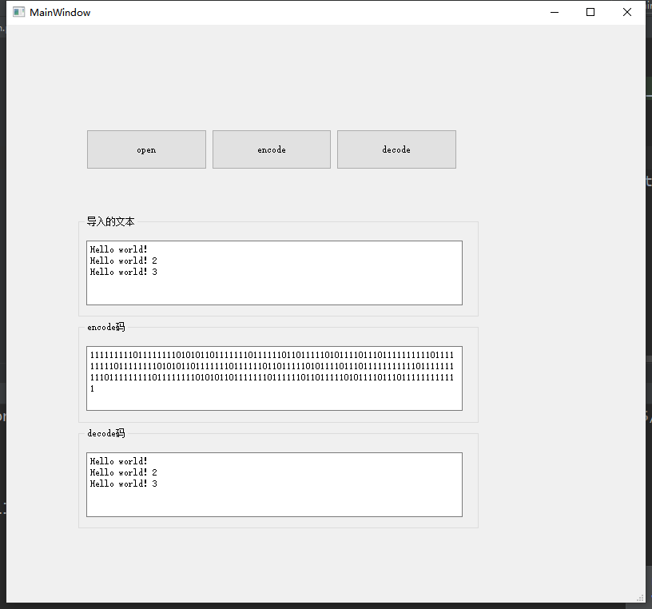
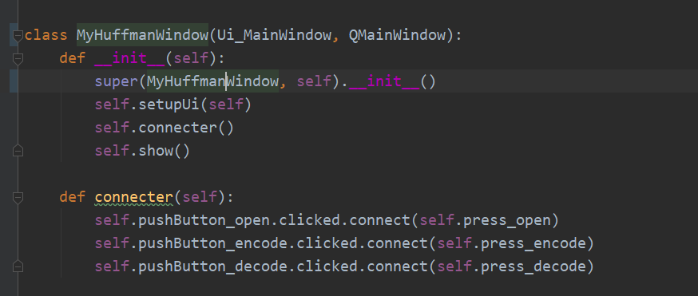
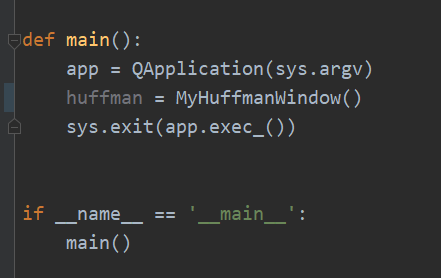
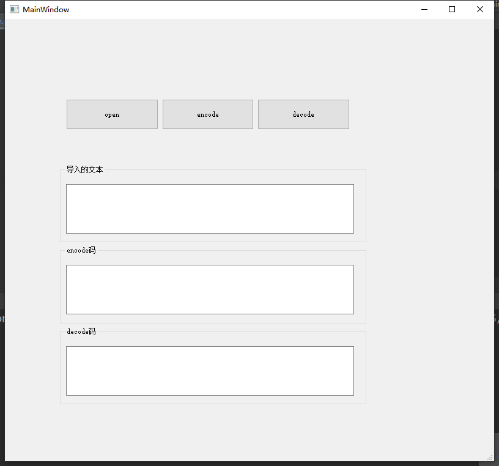
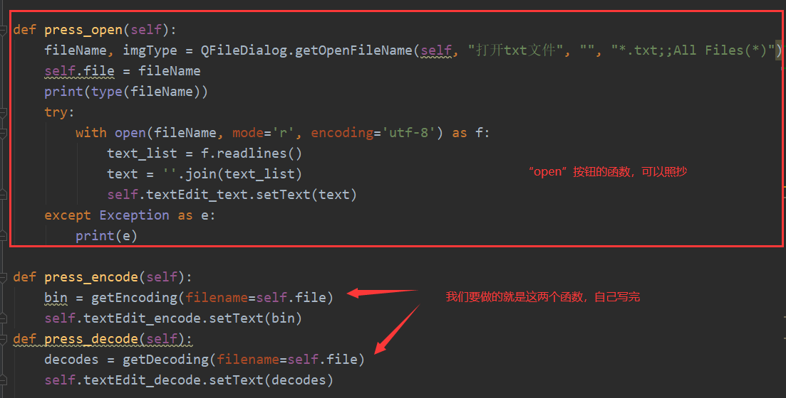

大家好，今天我们来做一个Huffman编码。

我们最终要做的效果图如下：

{width="5.763194444444444in"
height="5.381944444444445in"}

图1

**解释：**

我们要做一个可以将.txt文件内的英文字符串转换成Huffman编码的程序。

1.  "open"为打开按钮，用来打开.txt文件。打开xxx.txt文件后，会显示在"导入的文本"框内。

2.  "encode"按钮，用来将"导入的文本"里面的英文字符串，转换成二进制Huffman编码。

3.  "decode"按钮，用来将 "encode码"中的二进制，转换成文本。

4.  最后，可以比较一下原文本和解码后的文本是否相同。

    **操作步骤：**

<!-- -->

1.  打开pycharm、QtDesigner。

2.  使用QtDesigner
    拖动绘制界面，界面如"图1"所示。保存在项目文件中，取名为Huffman.ui。

3.  使用pyuic将Huffman.ui转换成.py文件。

4.  编写main.py（方法如第一次计算器作业）。

    {width="5.763194444444444in"
    height="2.446527777777778in"}

    图2

    {width="4.59375in"
    height="2.8958333333333335in"}

    图3

    **\*步骤1234如同第一次作业"计算器"。**

5.  运行主程序，使界面能跑通。

    {width="5.763194444444444in"
    height="5.381944444444445in"}

    图4

6.  编写相应按钮的函数

    {width="5.768055555555556in"
    height="2.928472222222222in"}

    图5

    **Author： 蔡正奕**
