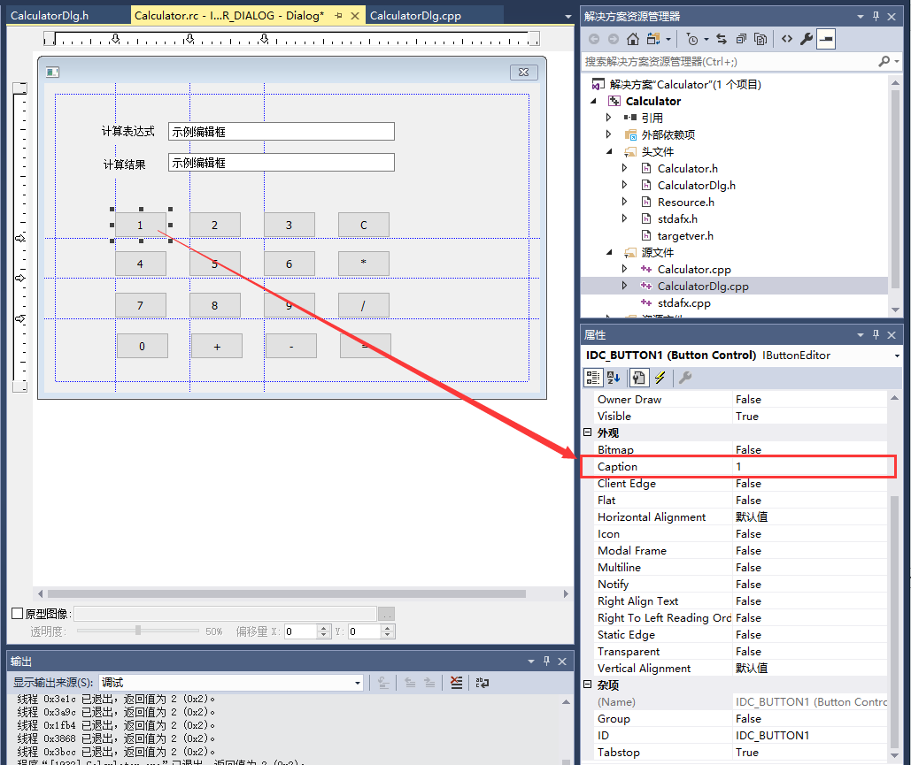
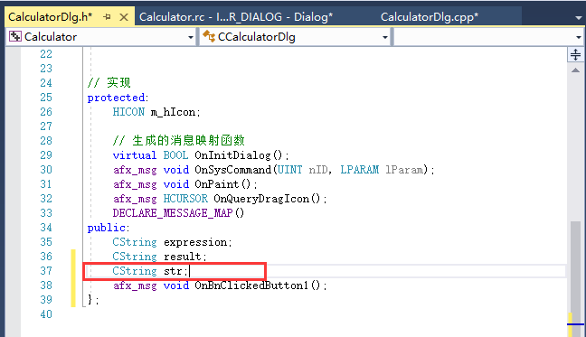

1.  表达式布局

{width="5.768055555555556in"
height="4.845138888888889in"}

{width="5.768055555555556in"
height="5.124305555555556in"}

2.  添加变量

{width="5.768055555555556in"
height="4.692361111111111in"}

{width="5.768055555555556in"
height="4.5993055555555555in"}

确认是否添加，查看

{width="5.768055555555556in"
height="4.352083333333334in"}

{width="5.768055555555556in"
height="5.468055555555556in"}

3.  数字控件布局

对于数字按钮控件做以下处理。

{width="5.768055555555556in"
height="4.848611111111111in"}

对于加减乘除等号等特殊按钮控件，一定要改ID，方便以后写相关程序和查错。

{width="5.768055555555556in"
height="4.909722222222222in"}

4.  添加按钮控件方法

额外添加公共变量str，用于之后计算处理。

{width="5.768055555555556in"
height="3.3201388888888888in"}

以按钮"1"为例，双击按钮"1"：

{width="5.768055555555556in"
height="5.61875in"}

加减乘除符号按钮控件也如是处理：

{width="5.768055555555556in"
height="4.417361111111111in"}

清除键按钮控件：

{width="4.968055555555556in"
height="2.2493055555555554in"}

等号按钮控件：

{width="4.926388888888889in"
height="1.551388888888889in"}

双击计算表达式编辑框，出现

{width="5.768055555555556in"
height="1.3263888888888888in"}

OnEnChangeExpressionEdit();函数即为你需要写的计算机计算主要程序，请自主完成。

作业提交：

1.  请于3月13日24：00前将作业以"作业几 学号
    姓名"形式上交压缩包，上交内容一个word的实验报告【详细功能（思路+实例）+核心代码】以及可以运行的项目。

> [实验课选了赵老师的同学发到910660298\@qq.com](mailto:实验课选了赵老师的同学发到nbudse2019@163.com)

2.  作业严禁抄袭，一经发现，均作零分处理。

例子参考：

{width="5.768055555555556in"
height="4.036111111111111in"}
